# CORE QA Headquarters

CORE QA Headquarters is the current QA hub pilot for the CORE project. The `.124` release board is the active implementation host while the larger HQ app is being separated from the original release-board workflow.

The hub keeps the existing Jira board usable, then layers in release-board navigation, a knowledge base, approved automation, operational health, and AI-assisted release summaries.

## Live Links

- Cloudflare HQ Worker: <https://core-qa-headquarters-124.dfkabir253.workers.dev/hq/>
- Cloudflare `.124` board: <https://core-qa-headquarters-124.dfkabir253.workers.dev/>
- GitHub Pages HQ fallback: <https://dewankabir009.github.io/jira-board-v3001-124-0/modern/hq/>
- GitHub Pages `.124` board fallback: <https://dewankabir009.github.io/jira-board-v3001-124-0/modern/>
- `.123` board: <https://dewankabir009.github.io/jira-board-v3001-123-0/modern/>
- `.122` board: <https://dewankabir009.github.io/jira-board-v3001-122-0/modern/>

GitHub Pages remains useful as a static fallback. The `.124` modern board and HQ are now Cloudflare-first. The live AI endpoint only works on the Cloudflare Worker URL because the Worker owns the `/api/*` routes and the Workers AI binding.

## Version Screenshots

### HQ Overview

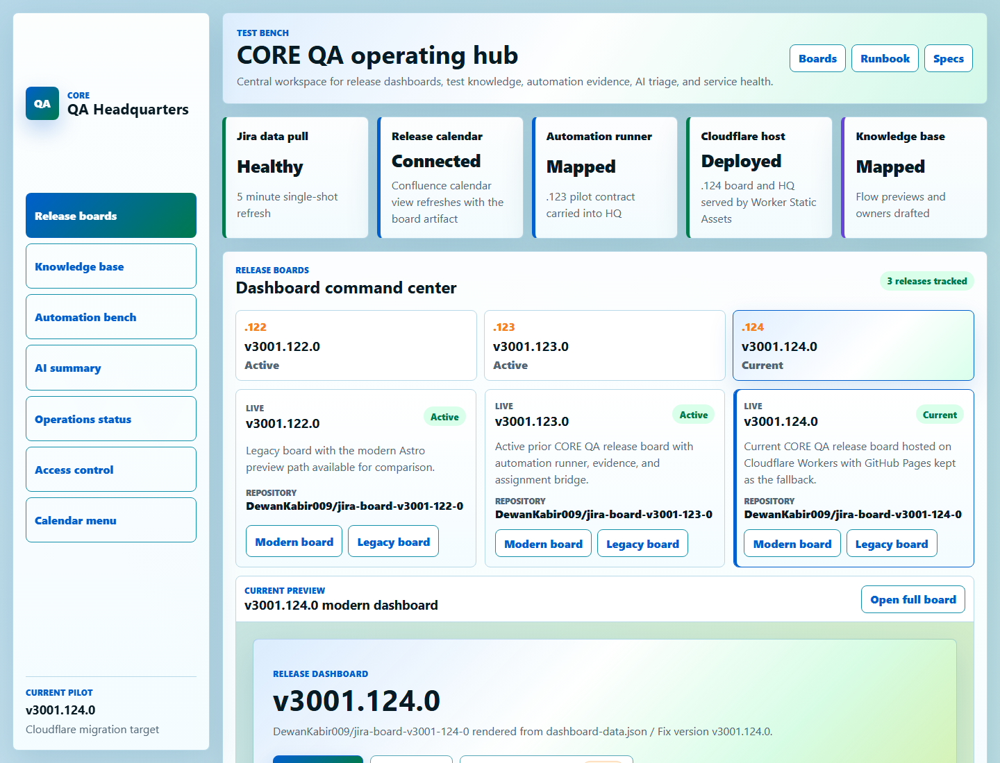

### Release Board Registry

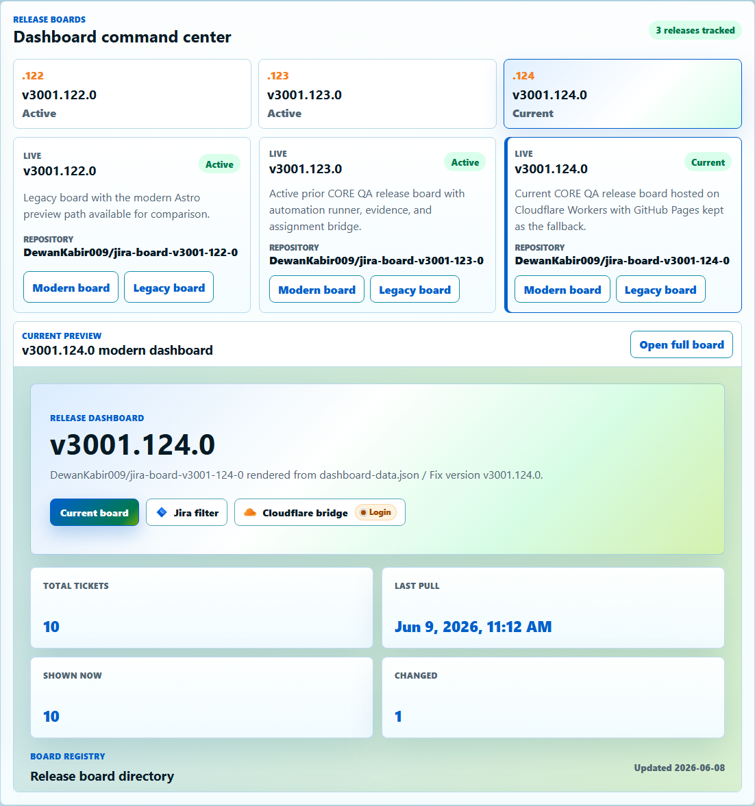

### Approved Automation Bench

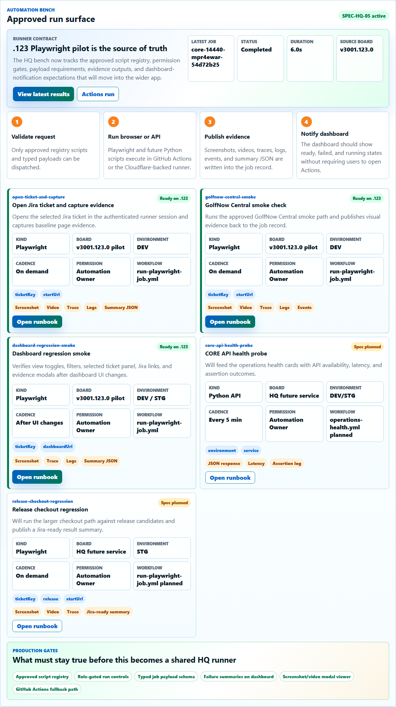

### Cloudflare Workers AI Ready State

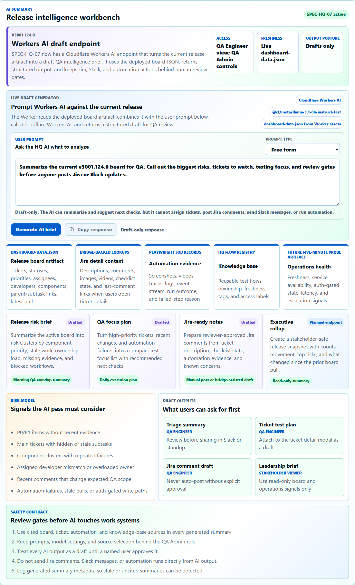

### Release Calendar Menu

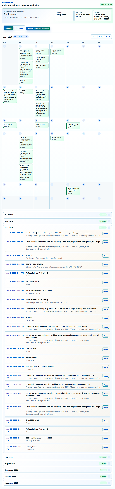

### Generated AI Release Brief

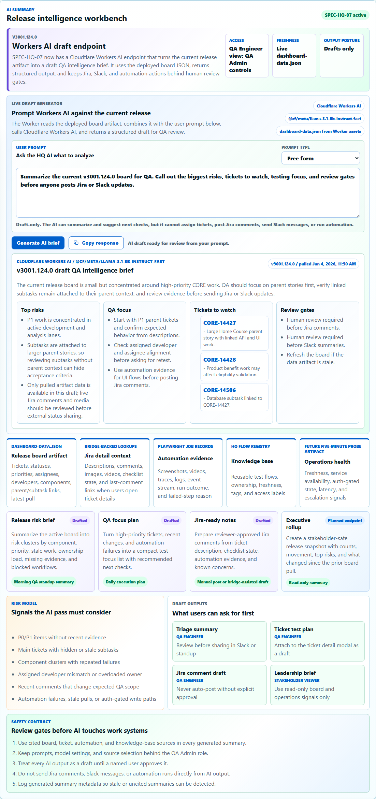

### Spec Checklist

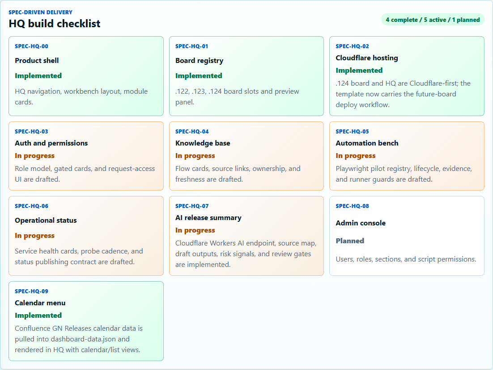

### Mobile HQ Overview

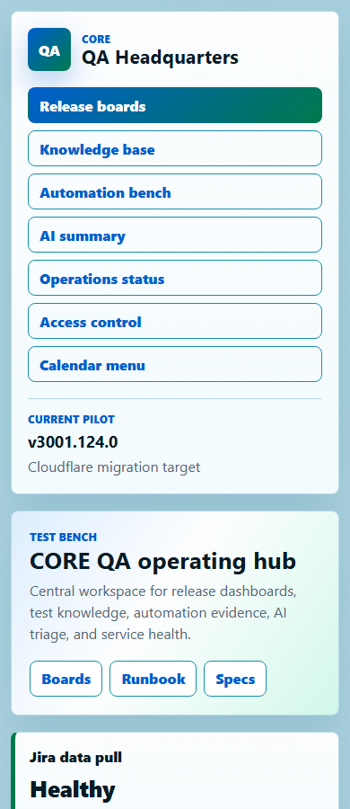

### v3001.122.0 Modern Board

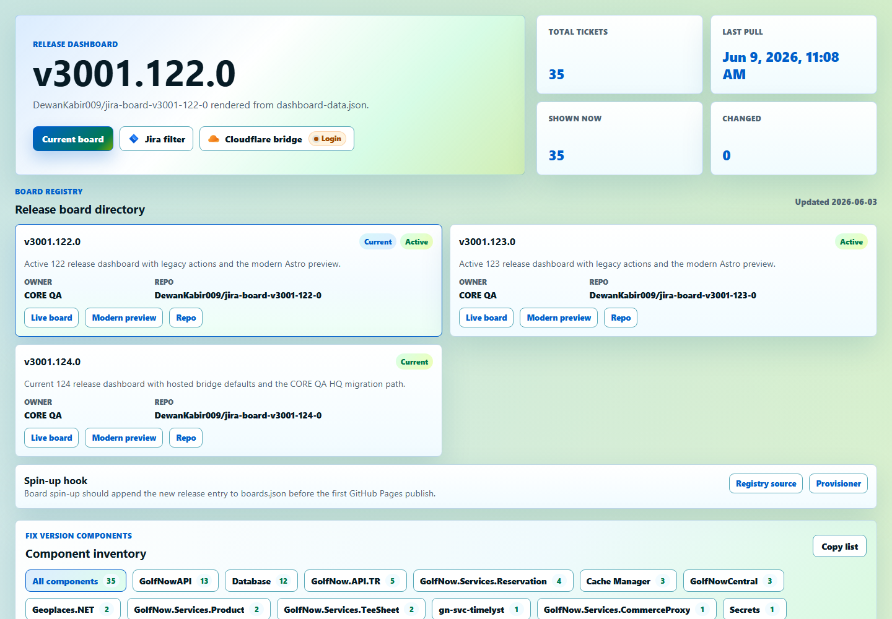

### v3001.123.0 Modern Board

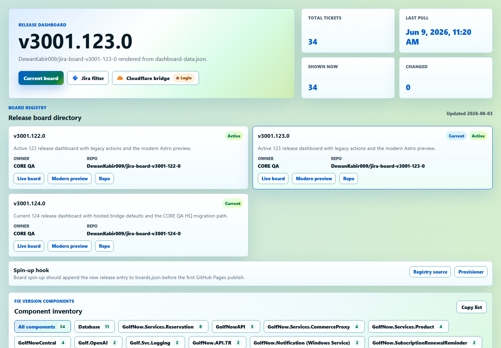

### v3001.124.0 Modern Board

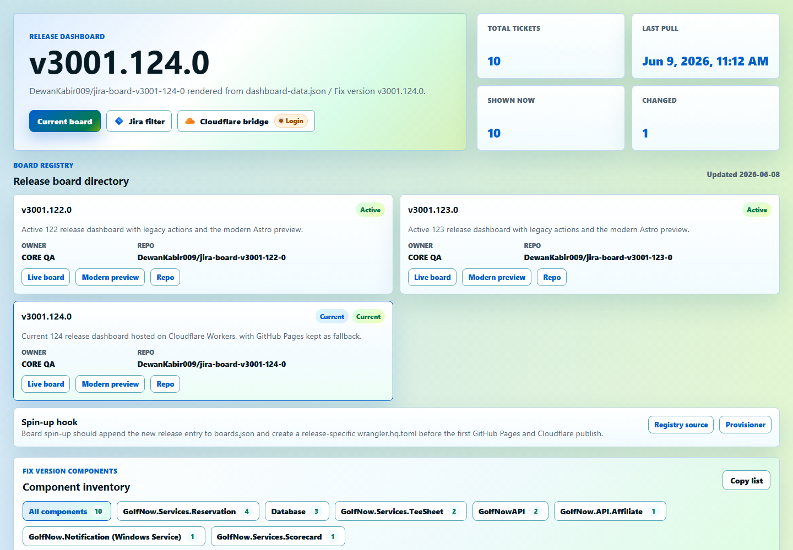

## What Is Implemented Now

- `/modern/` is the active `.124` release dashboard with ticket cards, table view, assignee actions, Jira search, comments, automation status, and ticket detail surfaces.
- `/modern/hq/` is the HQ landing route built with Astro and deployed as static assets.
- `/modern/hq/#calendar` is the Calendar Menu. It reads the Confluence GN Releases Team Calendar payload from `dashboard-data.json`, opens on the current month, provides month navigation, and groups the Upcoming list into collapsible month sections.
- `/api/ai/status` reports whether the Cloudflare Worker has the Workers AI binding.
- `/api/ai/release-summary` reads `dashboard-data.json`, resolves assignee/developer/component/priority ticket lookups from the direct board pull, asks Cloudflare Workers AI to turn those exact matches into human-readable linked analysis, or combines the user's broader prompt with compact ticket context for a draft release brief.
- GitHub Pages can render the same HQ page but cannot run the AI API. The page tells users to open the Cloudflare URL when the endpoint is unavailable.

## Architecture

```text
Jira fixVersion data
  -> GitHub Action refresh
  -> Confluence Team Calendar pull
  -> dashboard-data.json
  -> Astro modern dashboard and HQ shell
  -> Cloudflare Worker Static Assets
  -> /api/* Worker routes
  -> Cloudflare Workers AI release summary
```

The HQ Worker uses Cloudflare's Static Assets binding for the built Astro files and routes `/api/*` through the Worker first. The AI service is server-side only, so no model credentials or secrets are exposed in browser JavaScript.

Relevant files:

- `wrangler.hq.toml`: Cloudflare Worker, static assets, and Workers AI binding.
- `workers/hq-worker.js`: API routes for AI status and release summary.
- `modern-dashboard/src/pages/hq.astro`: HQ UI route and browser-side AI runner.
- `modern-dashboard/src/styles/qa-hq.css`: HQ design system and responsive styling.
- `modern-dashboard/scripts/capture-hq-readme-screenshots.cjs`: README screenshot capture harness.
- `docs/qa-headquarters/overview.md`: spec program overview.
- `docs/qa-headquarters/spec-hq-*.md`: individual spec contracts.

## Cloudflare Workers AI

The first Workers AI implementation is intentionally focused and review-first:

- Provider: Cloudflare Workers AI.
- Model: `@cf/meta/llama-3.1-8b-instruct-fast`.
- Endpoint: `POST /api/ai/release-summary`.
- Status check: `GET /api/ai/status`.
- Source data: the current board's `dashboard-data.json`.
- User input: visible HQ prompt composer with Free Form, ticket lookup, release triage, QA focus, Jira-ready notes, and leadership rollup presets.
- Output shape: structured JSON with executive brief, risks, focus tickets, and review gates.
- Ticket test plans: prompts like `make test plan for CORE-14427` override the selected preset and send the named ticket's description/comments to Workers AI with `answerType: "ticket_test_plan"`.
- Safety posture: draft-only, direct board-data lookup for assignment and component questions before AI narration, deterministic fallback if AI fails, and no Jira mutations from the AI endpoint.

The Worker requests JSON output from the model so the browser can render predictable sections instead of parsing free-form prose.

## Calendar Menu

The HQ Calendar Menu is a Confluence-backed release calendar module.

- Source: Confluence Team Calendar `GN Releases`.
- Default URL: <https://golfnow.atlassian.net/wiki/display/GQE/calendar/413a852e-d20c-454c-9808-425e167314f2?calendarName=GN%20Releases>.
- Refresh cadence: coupled to `refresh-jira-board.yml`, which runs every 5 minutes and on demand.
- Data contract: `dashboard-data.json.calendarMenu`.
- Views: Calendar grid and Upcoming list.
- Calendar navigation: the grid defaults to the current month instead of the oldest pulled event month, with Previous, Today, and Next controls.
- Upcoming organization: events are grouped under collapsible month sections so long maintenance/release lists stay scannable.
- Calendar source: one active GN Releases calendar is shown for now. `HQ_CALENDAR_SOURCES_JSON` is still parsed for future expansion, but the current HQ UI and data pull use the first configured source only.
- Failure behavior: Jira refreshes continue if Confluence calendar access fails; the dashboard artifact stores the calendar error and the HQ page shows a readable warning.

Calendar environment overrides:

| Variable | Purpose |
| --- | --- |
| `HQ_CALENDAR_URL` | Primary Confluence Team Calendar URL. |
| `HQ_CALENDAR_NAME` | Primary display name. |
| `HQ_CALENDAR_SOURCES_JSON` | Full source override array for future calendars; current HQ uses the first source only. |
| `HQ_CALENDAR_REFRESH_SECONDS` | Dashboard client refresh interval; default `300`. |
| `HQ_CALENDAR_LOOKBACK_DAYS` | Calendar pull window lookback; default `45`. |
| `HQ_CALENDAR_LOOKAHEAD_DAYS` | Calendar pull window lookahead; default `180`. |

## Spec Status

| Spec | Focus | Status | Notes |
| --- | --- | --- | --- |
| SPEC-HQ-00 | Product shell | Complete | HQ route, navigation, core panels, and visual language are in place. |
| SPEC-HQ-01 | Board registry | Complete | `.122`, `.123`, and `.124` boards are linked from the HQ. |
| SPEC-HQ-02 | Cloudflare hosting | Complete for `.124` | Cloudflare Workers Static Assets hosts the `.124` modern board at the Worker root and HQ at `/hq/`; the template carries the same deploy path for upcoming boards. |
| SPEC-HQ-03 | Auth and permissions | In progress | Locked-section pattern is represented; real role policy still needs identity integration. |
| SPEC-HQ-04 | Knowledge base | In progress | Registry shell is present for test-flow links and previews. |
| SPEC-HQ-05 | Automation bench | In progress | Approved Playwright job launcher, job status, and result links are represented. |
| SPEC-HQ-06 | Operational status | In progress | Status cards are modeled for future 5-minute API automation feeds. |
| SPEC-HQ-07 | AI release summary | In progress | First Cloudflare Workers AI endpoint and UI runner are implemented. |
| SPEC-HQ-08 | Admin console | Planned | Future user, permission, and section management surface. |
| SPEC-HQ-09 | Calendar menu | Complete | Confluence GN Releases calendar data is pulled into `dashboard-data.json` and rendered in HQ with Calendar and Upcoming tabs. |

## Technology Stack

| Technology | How It Is Used |
| --- | --- |
| Astro | Builds the static HQ route and modern release dashboard pages. |
| React islands | Power selected interactive dashboard experiences inside the modern board. |
| TypeScript and JavaScript | Own the UI logic, dashboard transformations, worker routes, and automation scripts. |
| Cloudflare Workers | Hosts the HQ as a Worker-backed web app and owns same-origin `/api/*` routes. |
| Cloudflare Workers Static Assets | Serves the built HQ and dashboard assets through the Worker. |
| Cloudflare Workers AI | Generates the draft release intelligence brief from current board data. |
| GitHub Actions | Refreshes Jira data, deploys static pages, runs Playwright jobs, and publishes evidence. |
| Confluence Team Calendars | Feeds the HQ Calendar Menu through the 5-minute board refresh artifact. |
| GitHub Pages | Keeps static public fallback pages live during the Cloudflare migration. |
| Wrangler | Builds, validates, and deploys the Cloudflare board and HQ Worker. |
| Playwright | Captures README screenshots and powers approved browser automation jobs. |
| Jira REST and dashboard artifacts | Provide release ticket data, comments, assignees, subtasks, and checklist context. |
| Cloudflare assignee bridge | Keeps Jira assignment and checklist comment writes off the user's laptop. |

## Build And Deploy

Install dependencies when needed:

```powershell
npm install --no-audit --no-fund
```

Build the HQ and modern dashboard:

```powershell
npm run build
```

Prepare the Cloudflare board and HQ asset folder:

```powershell
node scripts\prepare-cloudflare-hq-assets.cjs
```

Validate the Worker and bindings without publishing:

```powershell
npx -y wrangler deploy -c wrangler.hq.toml --dry-run
```

Deploy the Cloudflare board and HQ from GitHub Actions:

```powershell
gh workflow run deploy-cloudflare-hq.yml --ref master
```

Capture README screenshots:

```powershell
cd modern-dashboard
node scripts\capture-hq-readme-screenshots.cjs
```

## API Contracts

### `GET /api/ai/status`

Returns the AI runtime status.

```json
{
  "ok": true,
  "provider": "Cloudflare Workers AI",
  "model": "@cf/meta/llama-3.1-8b-instruct-fast",
  "hasBinding": true
}
```

### `POST /api/ai/release-summary`

Returns a structured release brief for the current dashboard data and the user's requested analysis angle.

Request:

```json
{
  "output": "release_brief",
  "promptTemplate": "release_triage",
  "userPrompt": "Summarize the current release board for QA and call out risks, tickets to watch, testing focus, and review gates."
}
```

Direct ticket lookup request. The Worker first performs the exact board-data lookup, then Workers AI turns the matched tickets into readable analysis while the response keeps Jira links and board-owned metadata attached:

```json
{
  "output": "release_brief",
  "promptTemplate": "ticket_lookup",
  "userPrompt": "What tickets are assigned to Dewan?"
}
```

Component lookup request:

```json
{
  "output": "release_brief",
  "promptTemplate": "ticket_lookup",
  "userPrompt": "Are there any tickets from Reservation?"
}
```

Priority lookup request:

```json
{
  "output": "release_brief",
  "promptTemplate": "free_form",
  "userPrompt": "How many P0 tickets are there?"
}
```

Ticket test-plan request:

```json
{
  "output": "release_brief",
  "promptTemplate": "leadership",
  "userPrompt": "make test plan for CORE-14427"
}
```

Lookup responses use the same renderable brief envelope with `answerType: "assignee_lookup"`, `answerType: "component_lookup"`, or `answerType: "priority_lookup"` and matching ticket details sourced from `dashboard-data.json`.

Free Form request:

```json
{
  "output": "release_brief",
  "promptTemplate": "free_form",
  "userPrompt": "Which tickets should QA focus on first and why?"
}
```

Free Form responses use `answerType: "free_form"` and ask Workers AI to answer from the current release issue list and stats. Relevant tickets render as links and the copy action exports Markdown-friendly ticket links.

Ticket test-plan responses use `answerType: "ticket_test_plan"` and render coverage risks, test scenarios, related tickets, and review gates from the named ticket context.

Response:

```json
{
  "ok": true,
  "provider": "Cloudflare Workers AI",
  "model": "@cf/meta/llama-3.1-8b-instruct-fast",
  "release": "v3001.124.0",
  "stats": {
    "total": 30,
    "main": 18,
    "subtasks": 12
  },
  "brief": {
    "headline": "Release summary",
    "summary": [],
    "risks": [],
    "focusTickets": [],
    "reviewGates": []
  }
}
```

## Documentation Map

- `docs/qa-headquarters/overview.md`: HQ modernization program overview.
- `docs/qa-headquarters/spec-hq-00-product-shell.md`: HQ shell and navigation.
- `docs/qa-headquarters/spec-hq-01-board-registry.md`: board registry and spin-up direction.
- `docs/qa-headquarters/spec-hq-02-cloudflare-hosting.md`: Cloudflare hosting and fallback path.
- `docs/qa-headquarters/spec-hq-03-auth-permissions.md`: access control and locked content behavior.
- `docs/qa-headquarters/spec-hq-04-knowledge-base.md`: knowledge base registry.
- `docs/qa-headquarters/spec-hq-05-automation-bench.md`: approved automation runner.
- `docs/qa-headquarters/spec-hq-06-operational-status.md`: service health and API automation status.
- `docs/qa-headquarters/spec-hq-07-ai-release-summary.md`: Workers AI release intelligence.

## Current Migration Notes

- `.124` is the current HQ implementation host.
- A standalone HQ repo is still a future extraction step; this README documents the current deployed HQ pilot.
- The Cloudflare Worker root is the current `.124` modern board; `/hq/` is the HQ route.
- GitHub Pages should continue to work as a fallback while Cloudflare owns dynamic routes.
- Upcoming release-board repos should copy `wrangler.hq.toml.example` to `wrangler.hq.toml`, set the release-specific Worker name and URLs, keep `CLOUDFLARE_API_TOKEN` as a repo secret, then run `Deploy Cloudflare Board and HQ`.
- The AI brief is not a source of truth. It is a fast review aid generated from the current dashboard artifact.
- Any future Jira writes, comments, or automation runs should stay explicit and user-approved in the UI.
